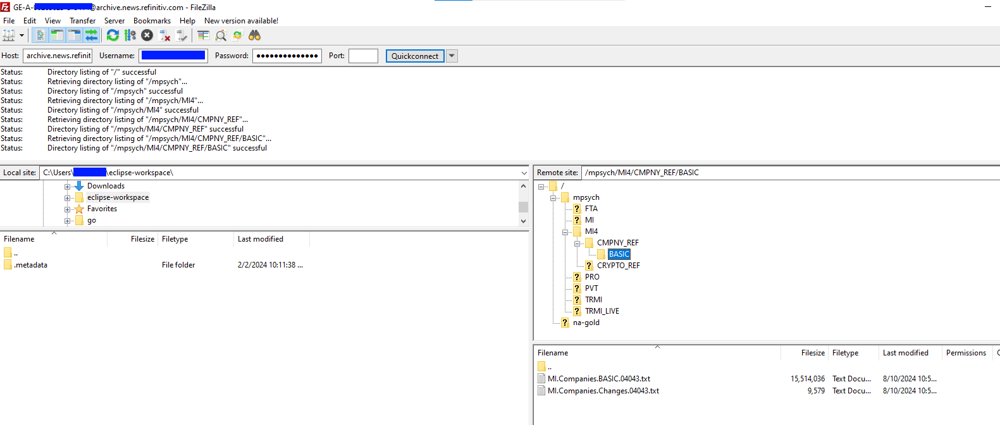

# Machine Readable News with SFTP Python Example

- Last update: Sep 2024
- Environment: Windows
- Compiler: Python
- Prerequisite: MRN Archive service account

## Overview

Machine Readable News (MRN) is an advanced service for automating the consumption and systematic analysis of news. It delivers deep historical news archives, ultra-low latency structured news and news analytics directly to your applications. This enables algorithms to exploit the power of news to seize opportunities, capitalize on market inefficiencies, and manage event risk. 

The MRN data Real-Time news and News Analytics data are available for consumers via the LSEG Real-Time Platform and SFTP connections. While the Real-Time news connection can be accessed programmatically only (we have covered it via the [Introduction to Machine Readable News (MRN) with Enterprise Message API (EMA)](https://developers.lseg.com/en/article-catalog/article/introduction-machine-readable-news-mrn-elektron-message-api-ema) and [Introduction to Machine Readable News with WebSocket API](https://developers.lseg.com/en/article-catalog/article/introduction-machine-readable-news-elektron-websocket-api-refinitiv) articles), the SFTP connection can be access with any SFTP applications like the [FileZilla](https://filezilla-project.org/), [WinSCP](https://winscp.net), or even Windows native ```SFTP``` command. 

However, some developers might need to access the SFTP remote server and get the file programmatically. This project shows a step-by-step guide to access and get the file from the MRN Remote SFTP site using the [Python](https://www.python.org/) programming language with the [Paramiko library](https://www.paramiko.org/) on the [JupyterLab notebook](https://jupyter.org/).

## Example Prerequisite

This example requires the following dependencies software and libraries.

1. Python [Anaconda](https://www.anaconda.com/distribution/) or [MiniConda](https://docs.conda.io/en/latest/miniconda.html) distribution/package manager.
2. [JupyterLab](https://jupyter.org/) application.
3. MRN Archive SFTP access with credential
4. Internet connection.

Please contact your LSEG representative or Account Manager to help you to access the MRN access.

## How to run this example

The first step is to unzip or download the example project folder into a directory of your choice.

### Set Up and Run A Jupyter Notebook Environment

It is an advisable to create a dedicate Python environment to run each Python project. You can create a new Conda environment names *MRN_FTP* with the following steps

1. Open Anaconda Prompt and go to the project's folder
2. Run the following command in an Anaconda Prompt to create a Conda environment named *MRN_FTP* for the project.

  ```bash
  (base) $>conda create --name MRN_FTP python=3.10
  ```

3. Once the environment is created, activate the MRN_FTP environment with this command in Anaconda Prompt

  ```bash
  (base) $>conda activate MRN_FTP
  ```

4. Run the following command to install the dependencies in the *MRN_FTP* environment

  ```bash
  (MRN_FTP) $>pip install -r requirements.txt
  ```
5. Create a file name ```.env``` with the following Machine-ID content in the project folder.

  ```ini
  MACHINE_ID=YOUR_MACHINE_D
  PASSWORD=YOUR_PASSWORD
  ```

6. In the current Anaconda Prompt, go to the project's notebook folder. Run the following command to start the JupyterLab application in the notebook folder.

  ```bash
  (MRN_FTP) $>jupyter lab
  ```
7. Open *mrn_sftp_app.ipynb* notebook application, then follow through each notebook cell.



## <a id="references"></a>References

For further details, please check out the following resources:

- [LSEG Developer Community](https://developers.lseg.com/) website.
- [Machine Readable News](https://www.lseg.com/en/data-analytics/financial-news-services/machine-readable-news) website.
- [Paramiko offical website](https://www.paramiko.org/)
- [Paramiko API document](https://docs.paramiko.org/en/latest/)
- [Paramiko SFTP API document](https://docs.paramiko.org/en/latest/api/sftp.html)
- [Paramiko Client API document](https://docs.paramiko.org/en/latest/api/client.html)
- [Paramiko- How to transfer files with Remote System (SFTP Servers) using Python](https://medium.com/nerd-for-tech/paramiko-how-to-transfer-files-with-remote-system-sftp-servers-using-python-52d3e51d2cfa) blog post.
- [How-to: Python Paramiko](https://manicodes.hashnode.dev/how-to-python-paramiko) blog post.
- [Paramiko SFTP: A Guide with Examples](https://sftpcloud.io/learn/python/paramiko-sftp-examples) website.

