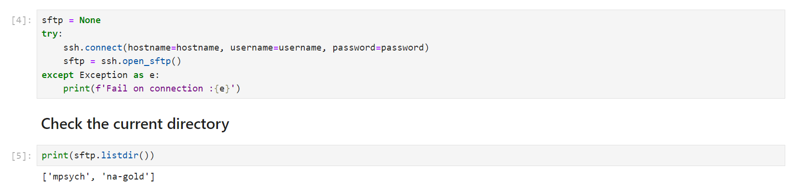
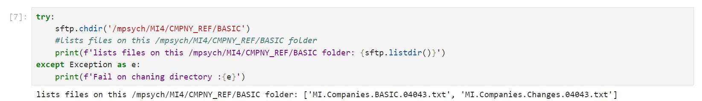
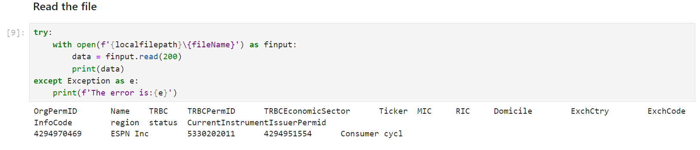

# Getting Machine Readable News Data via SFTP

## Overview

Machine Readable News (MRN) is an advanced service for automating the consumption and systematic analysis of news. It delivers deep historical news archives, ultra-low latency structured news and news analytics directly to your applications. This enables algorithms to exploit the power of news to seize opportunities, capitalize on market inefficiencies, and manage event risk. 

The MRN data Real-Time news and News Analytics data are available for consumers via the LSEG Real-Time Platform and SFTP connections. While the Real-Time news connection can be accessed programmatically with the Real-Time APIs only (we have covered it via the [Introduction to Machine Readable News (MRN) with Enterprise Message API (EMA)](https://developers.lseg.com/en/article-catalog/article/introduction-machine-readable-news-mrn-elektron-message-api-ema) and [Introduction to Machine Readable News with WebSocket API](https://developers.lseg.com/en/article-catalog/article/introduction-machine-readable-news-elektron-websocket-api-refinitiv) articles), the SFTP connection can be access with any SFTP applications like the [FileZilla](https://filezilla-project.org/), [WinSCP](https://winscp.net), or even Windows native ```SFTP``` command. 


However, some developers might need to access the SFTP remote server and get the MRN file programmatically. This article shows a step-by-step guide to access and get the file from the MRN Remote SFTP site using the [Python](https://www.python.org/) programming language with the [Paramiko library](https://www.paramiko.org/) on the [JupyterLab notebook](https://jupyter.org/).

## Prerequisite

Before I am going further, there is some prerequisite, dependencies, and libraries that the project is needed.

### Python 

This article demonstrates in Python programming language. You need the [Python SDK](https://www.python.org/) (at least version 3.10.x) or [Anaconda](https://www.anaconda.com/)/[Miniconda](https://docs.anaconda.com/miniconda/) Python distribution.

I am using the Miniconda Python distribution as an example.

### JupyterLab Application

JupyterLab is an interactive a browser-based REPL application that includes the source code, output with documentation in the same document file. Developer can reads the document, run each cell and see the result instantly. 

The example code uses [JupyterLab](https://jupyter.org/) application as a Jupyter Notebook server application.

### Access to the MRN SFTP

This project uses MRN Machine-ID access credentials to connect to MRN SFTP remote server.

Please contact your LSEG representative to help you with the MRN access.

That covers the prerequisite of this project.

## Code Walkthrough

The chosen SFTP connection library for this demonstration is [Paramiko](https://pypi.org/project/paramiko/) ([PyPI](https://pypi.org/project/paramiko/)). I choose it over [pysftp](https://pypi.org/project/pysftp/) because Paramiko is more up-to-date library when compare with the outdated-pysftp. However, the concept for connecting to the SFTP remote server and get the file can be applied to any programming languages and libraries.

### Preparing a connection

The first step is importing the required library and module.

```python
import paramiko
```

Next, create variables for storing MRN credential and MRN connection point.

```python
username = 'Machine-ID' #Or input your Machine-ID Manually
password = 'Password'
hostname = 'archive.news.refinitiv.com'
localfilepath = '.\download'
```

I am putting the downloaded file on the &lt;project location&gt;\download folder, so the **localfilepath** variable is set to '.\download'

Let leave the initial variables process here.

### Establish the SSH Client

The high-level client API starts with creation of an [SSHClient](https://docs.paramiko.org/en/latest/api/client.html#paramiko.client.SSHClient) object. The **SSHClient** object encapsulate all supported connection types (such as SSH, SFTP, etc). It is a starting point for an application.

```python
ssh = paramiko.SSHClient()
# Automatically add host keys (not secure for production)
ssh.set_missing_host_key_policy(paramiko.AutoAddPolicy()) 
```

Please be noticed about the second statement above. The *set_missing_host_key_policy(paramiko.AutoAddPolicy())* method adds the hostname and new host key to the local HostKeys object automatically. Please note that it is **for the demonstration purpose only**.  You should add a known host key to the connection with Paramiko's [SSHClient.load_system_host_keys()](https://docs.paramiko.org/en/latest/api/client.html#paramiko.client.SSHClient.load_system_host_keys) method in the production use.

### Connect to the Remote Server and Establish the SFTP client connection

Next, we use the newly created ```ssh``` client object to connect to the MRN SFTP remote server and open the SFTP connection.

```python
sftp = None
try:
    ssh.connect(hostname=hostname, username=username, password=password)
    sftp = ssh.open_sftp()
except Exception as e:
    print(f'Fail on connection :{e}')
```

Once a connection is succeed, the library returns [SFTPClient](https://docs.paramiko.org/en/latest/api/sftp.html#paramiko.sftp_client.SFTPClient) object to an application which application can use it to interact with the SFTP remote server.

To test if our SFTPClient object is connected to the MRN remote server, you can list the current directory with the SFTPClient interface as follows:

```python
print(sftp.listdir())
```

The result is shown below:



That covers the SFTP client connection part.

### Change Directory and Get a File

Now our Python application is connected to the MRN SFTP remote server. You can use the SFTPClient object to navigate to the desired directory on the remote server and get the MRN files. 

**Note**: You can use any SFTP client application to navigate through the MRN SFTP remote server to get the file and directory path that you need.

I am demonstrating with the */mpsych/MI4/CMPNY_REF/BASIC* folder and get the first file from this folder. To check the directory, you can use the **SFTPClient.chdir()** method.

```python
try:
    sftp.chdir('/mpsych/MI4/CMPNY_REF/BASIC')
    #lists files on this /mpsych/MI4/CMPNY_REF/BASIC folder
    print(f'lists files on this /mpsych/MI4/CMPNY_REF/BASIC folder: {sftp.listdir()}')
except Exception as e:
    print(f'Fail on chaning directory :{e}')   
```



The download the file with the **SFTPClient.get()** method.

```python
# Get the first file name
fileName = sftp.listdir()[0]
try:
    sftp.get(remotepath = fileName, localpath=f'{localfilepath}\{fileName}')
except Exception as e:
    print(f'Fail on get a file :{e}')  
```

Next, read the file's content from &lt;project location&gt;\download folder to confirm if the file is download. 

```python
try:
    with open(f'{localfilepath}\{fileName}') as finput:
        data = finput.read(200)
        print(data)
except Exception as e:
    print(f'The error is:{e}')
```



### Closing A Connection

The last step is to closing our connection. Firstly, an application needs to close the SFTP session.

```python
sftp.close()
```

Lastly, close the SFTP SSH Client session.

```python
ssh.close()
```

That all I have to say about how to connect to MRN SFTP remote server and download the file.

## Next Step 

This source code example just shows the basic step of getting the MRN file from the MRN SFTP remote server. Developers can use any SFTP library and any programming language to perform the same task with the same concept. You can apply this concept to make an application that run schedule to get MRN file, or crate an GUI application for ease-of-use case.

Or if you need the Real-Time MRN data content, you can use the [Real-Time APIs](https://developers.lseg.com/en/use-cases-catalog/refinitiv-real-time) to consume the real-time MRN streaming data from the LSEG Real-Time Platform too.

## <a id="references"></a>References

For further details, please check out the following resources:

- [LSEG Developer Community](https://developers.lseg.com/) website.
- [Machine Readable News](https://www.lseg.com/en/data-analytics/financial-news-services/machine-readable-news) website.
- [Paramiko offical website](https://www.paramiko.org/)
- [Paramiko API document](https://docs.paramiko.org/en/latest/)
- [Paramiko SFTP API document](https://docs.paramiko.org/en/latest/api/sftp.html)
- [Paramiko Client API document](https://docs.paramiko.org/en/latest/api/client.html)
- [Paramiko- How to transfer files with Remote System (SFTP Servers) using Python](https://medium.com/nerd-for-tech/paramiko-how-to-transfer-files-with-remote-system-sftp-servers-using-python-52d3e51d2cfa) blog post.
- [How-to: Python Paramiko](https://manicodes.hashnode.dev/how-to-python-paramiko) blog post.
- [Paramiko SFTP: A Guide with Examples](https://sftpcloud.io/learn/python/paramiko-sftp-examples) website.
